# Microsoft公式ドキュメントをわかりやすく解説するCopilotエージェントの作り方

Micorosoftの公式Learnサイトの日本語が分かりづらいと感じたことはありませんか？
Copilot Studio の画面操作だけで、Microsoft Learn の公式ドキュメントとコード例を検索して分かりやすい日本語で解説するエージェントを作成し、Microsoft 365 Copilot で利用できるようにする手順です。
作成時間は15分です。

このガイドでは、実際に作成した `Microsoft Learn ガイド` が Microsoft 365 Copilot で MCP を呼び出し、Microsoft Learn の根拠 URL 付きで回答するところまで確認します。

Microsoft Learn MCP Server は、`https://learn.microsoft.com/api/mcp` で提供される Streamable HTTP のリモート MCP サーバーです。認証は不要で、現在は次の3ツールを提供します。

- `microsoft_docs_search`: Microsoft Learn の公式ドキュメントを検索
- `microsoft_docs_fetch`: 指定した公式ページの本文を取得
- `microsoft_code_sample_search`: 公式コードサンプルを検索

ツールは将来変更される可能性があります。Copilot Studio は接続時に利用可能なツールを動的に検出します。

## 完成イメージ

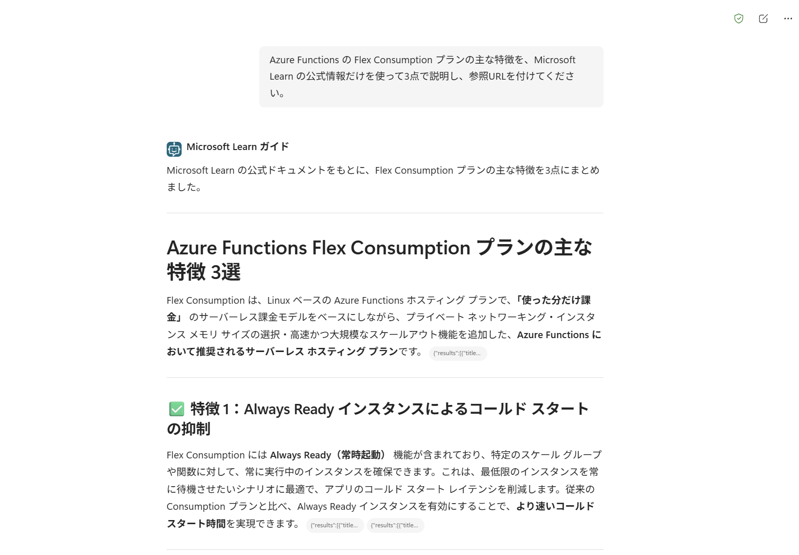

## 前提条件

作業前に次を確認してください。

- Microsoft 365 Copilot ライセンスが作成者と利用者に割り当てられている
- [Copilot Studio](https://copilotstudio.microsoft.com/) を開ける
- 作成者にその環境の `Environment Maker` ロールがある
- 組織の DLP ポリシーで Microsoft Learn コネクタの利用が許可されている

### この構成の追加料金

このガイドと同じ構成では、**Microsoft 365 Copilot ライセンスを持つ利用者が、本人の認証済み ID で Microsoft 365 Copilot または Teams からエージェントを使う場合、Copilot Studio の追加 Copilot Credits 課金はありません**。エージェントが呼び出す生成回答、ツール、エージェント アクションも、この条件では Microsoft 公式の料金表で `No charge` とされています。Microsoft Learn MCP Server 自体も無料です。

つまり、利用者が Microsoft 365 Copilot ライセンスを持つ今回の使い方では、既存のライセンス料とは別に Copilot Studio 容量を購入する必要はありません。

次の場合は別途課金またはライセンス確認が必要です。

- Microsoft 365 Copilot ライセンスを持たない利用者が使う場合
- エージェントからではないトリガーでエージェント フローを実行する場合
- Computer-Using Agent や別料金の外部サービスを追加する場合
- Microsoft 365 Copilot や Teams 以外のチャネル、匿名ユーザー向けに展開する場合

この包含特典には fair usage limits が適用されます。条件は変更される可能性があるため、本番展開前に最新の[料金表](https://learn.microsoft.com/microsoft-copilot-studio/requirements-messages-management#copilot-credits-billing-rates)と[拡張機能のコスト](https://learn.microsoft.com/microsoft-365/copilot/extensibility/cost-considerations#licensing-options-for-microsoft-365-copilot)を確認してください。

> [!NOTE]
> 画面名や配置は更新によって変わる場合があります。このガイドのスクリーンショットは日本語 UI です。

## 1. エージェントを作成する

1. [Copilot Studio](https://copilotstudio.microsoft.com/) を開き、右上で作成先の環境を確認します。
2. **エージェント**を開き、**新しいエージェント**を選択します。
3. 名前、説明、指示を設定して作成します。

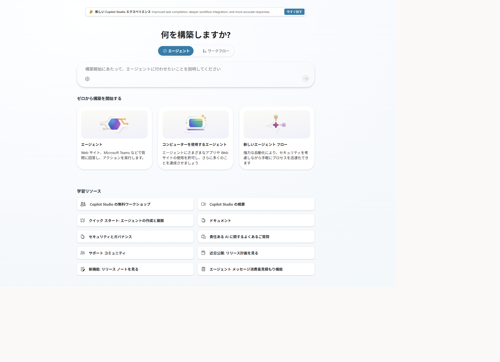

このガイドでは次の値を使います。

**名前**

```text
Microsoft Learn ガイド
```

**説明**

```text
Microsoft Learn の最新公式ドキュメントとコード例を検索し、根拠 URL 付きで回答します。
```

**指示**

```text
あなたは Microsoft 製品とサービスの公式ドキュメント案内役です。

Microsoft、Azure、Microsoft 365、Power Platform、.NET、Windows、開発者ツールに関する質問では、必ず Microsoft Learn Docs MCP Server を使って最新の公式情報を確認してください。

- 回答は日本語で、結論を先に簡潔に示してください。
- 詳細な手順や制限事項が必要な場合は、公式ドキュメントの内容を確認してください。
- コード例を求められた場合は、公式コードサンプルを探してください。
- 回答には重要な根拠の URL を示してください。
- 公式情報で確認できない内容は推測せず、その旨を明記してください。
```

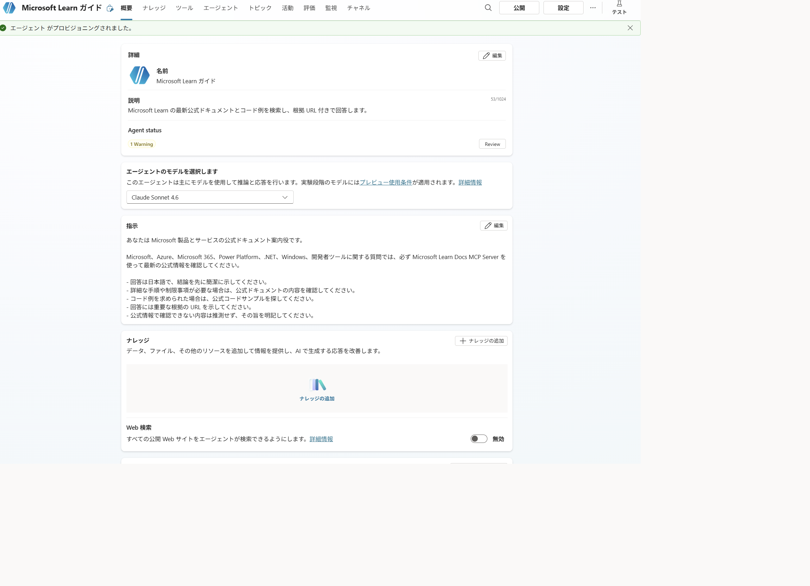

モデルは組織で利用可能なものを選択します。MCP の動作確認を明確にするため、このガイドでは **Web 検索**を無効にしています。

## 2. Microsoft Learn MCP ツールを追加する

1. エージェント上部の**ツール**を開きます。
2. **ツールの追加**を選択します。

3. 検索欄に `Microsoft Learn` と入力します。
4. 認定済みコネクタ **Microsoft Learn ドキュメント MCP サーバー**を選択します。

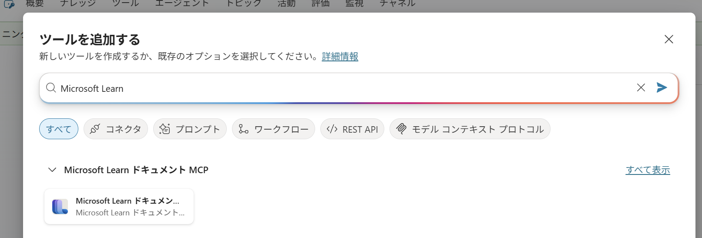

「Microsoft Learn コンテンツを検索するMCPサーバー」と入力
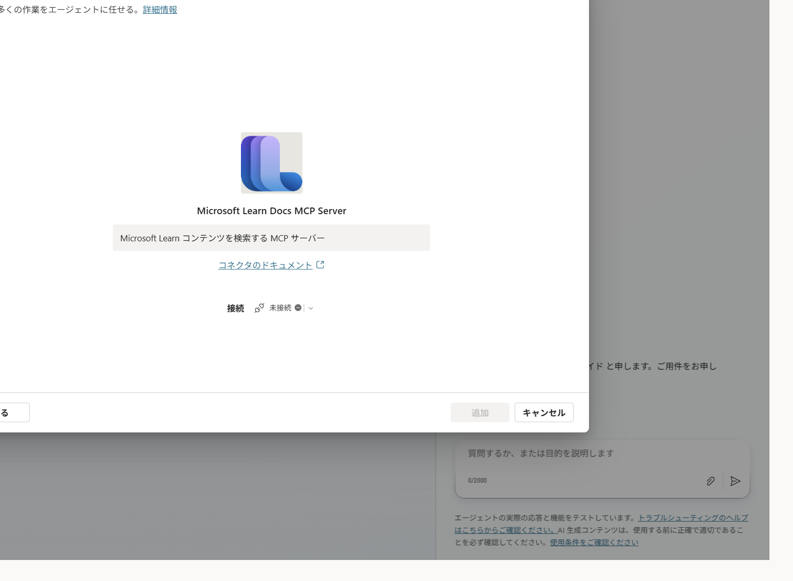

5. **新しい接続を作成する**を選択します。
6. 接続作成画面で**作成**を選択します。接続名は任意です。

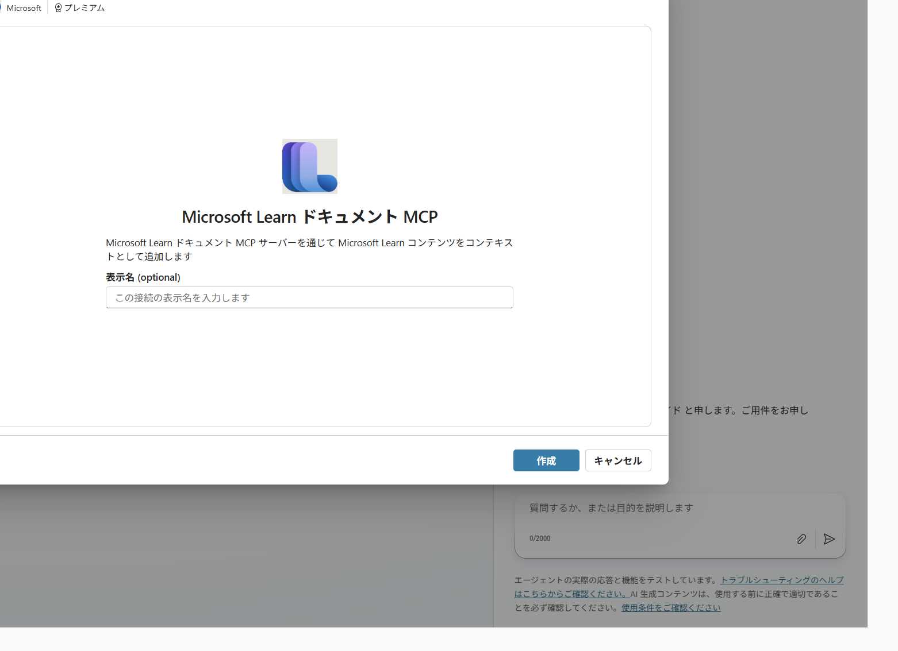

7. 接続済みになったら、ツールを追加します。

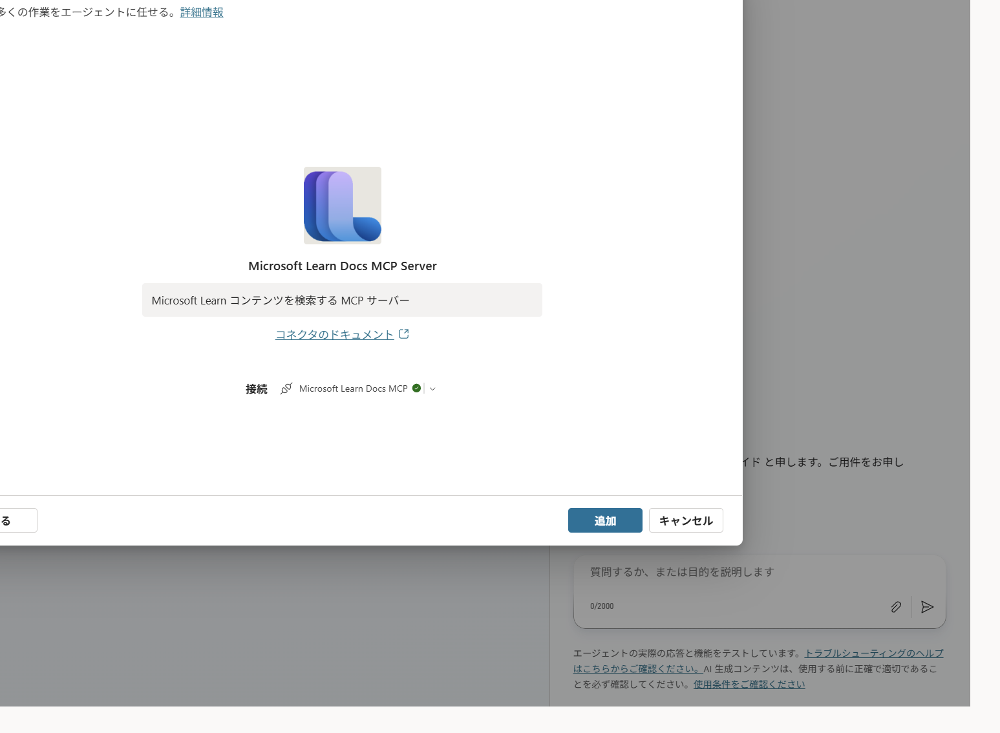

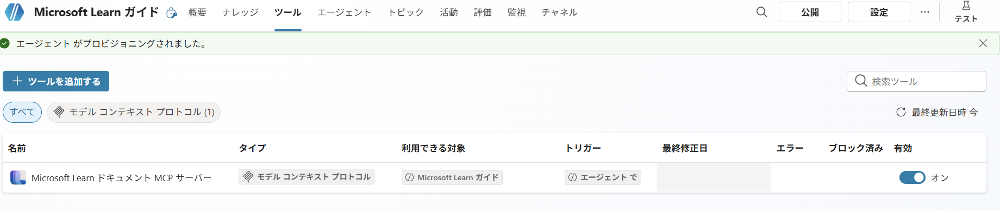

## 3. Copilot Studio でテストする

1. 右上の**テスト**を開きます。
2. 次の質問を送信します。

```text
Azure Functions の Flex Consumption プランの特徴を3つ、Microsoft Learn の根拠 URL 付きで教えてください。
```

初回は、接続が必要であることを示すメッセージが表示される場合があります。

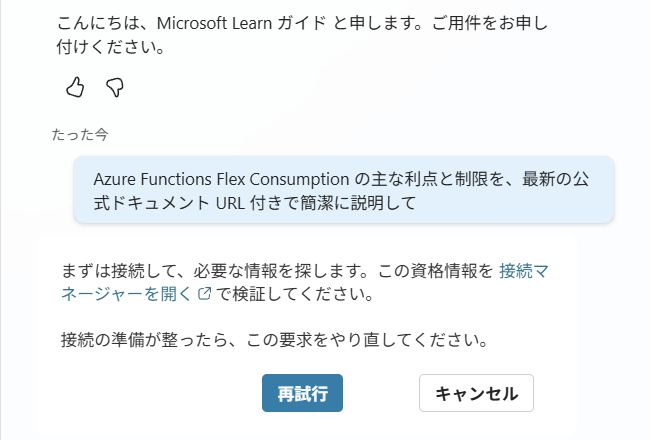

3. **接続マネージャーを開く**を選択します。
4. `Microsoft Learn ドキュメント MCP` の接続を確認します。
5. 必要に応じて接続を作成または更新し、状態が**接続済み**になったら**送信**を選択します。

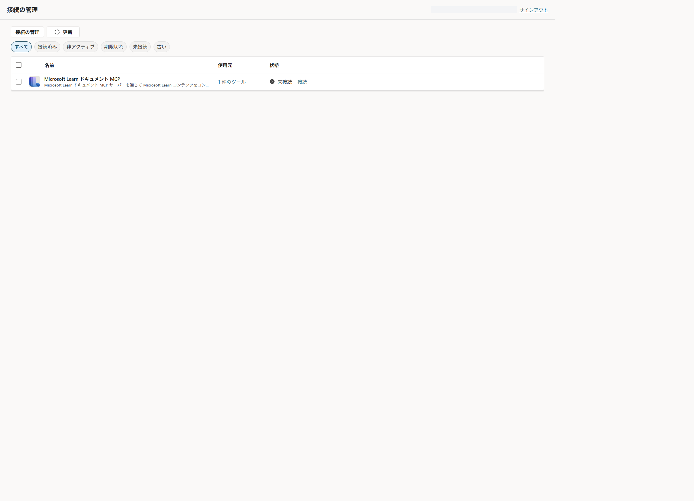

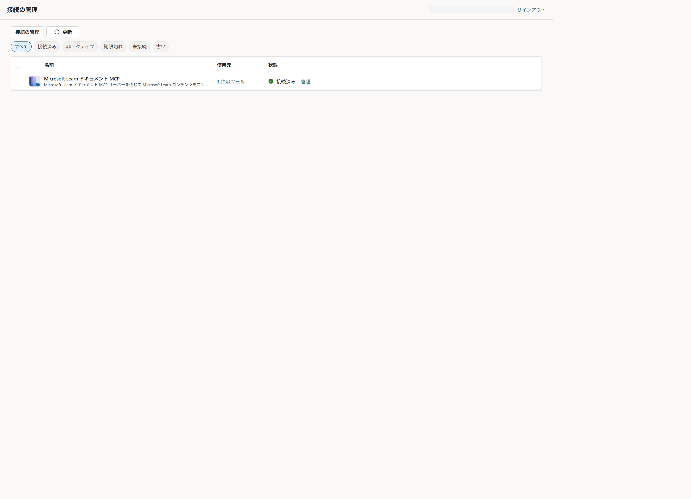

6. 同じ質問をもう一度送信します。
7. 活動マップで MCP サーバーの初期化と3つのツール検出を確認します。
8. `microsoft_docs_search` が完了し、回答に Microsoft Learn の URL と引用が含まれることを確認します。

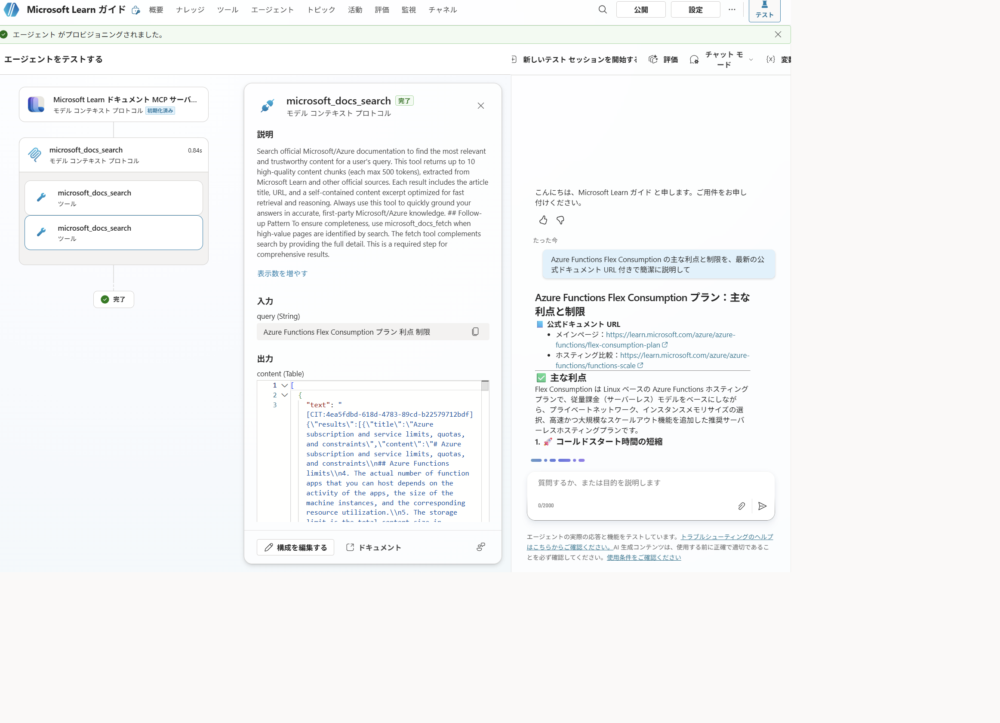

## 4. 公開する

1. 右上の**公開**を選択します。
2. 確認ダイアログでも**公開**を選択します。

## 5. Microsoft 365 Copilot チャネルを追加する

1. エージェント上部の**チャネル**を開きます。
2. **Microsoft 365 と Microsoft Teams**を選択します。

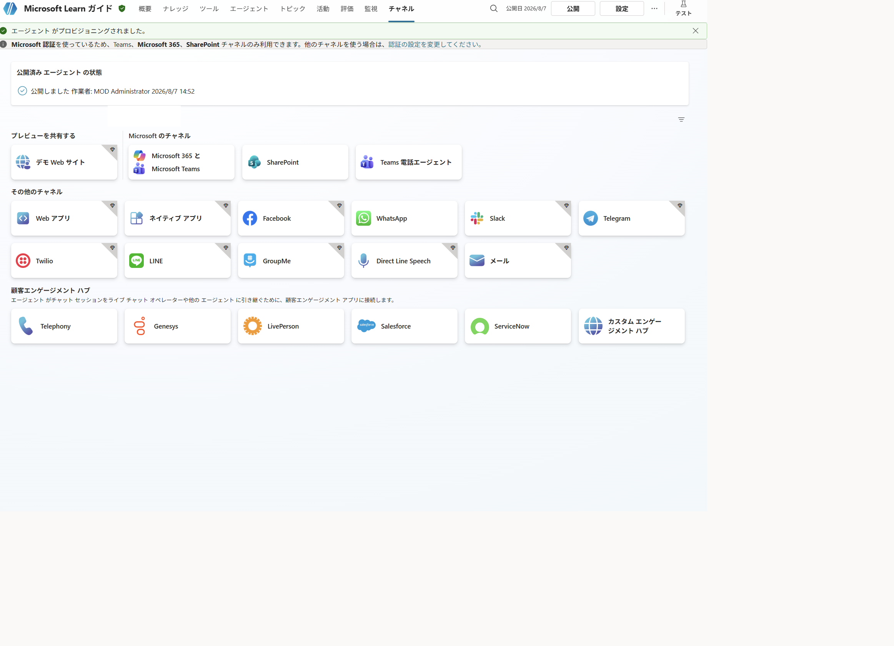

3. **Microsoft 365 Copilot でエージェントを使用できるようにする**をオンにします。
4. **チャネルを追加する**を選択します。
5. 「チャネルが追加されました」と表示されることを確認します。

## 6. 利用者へ共有する

### パイロット利用

1. Microsoft 365 と Microsoft Teams のチャネル詳細で、**チームメイトと共有ユーザーに表示する**を選択します。
2. 利用を許可するユーザーまたはセキュリティ グループを追加します。
3. **[同僚による構築] に表示する**をオンにします。
4. **共有**を選択します。

共有相手を限定すると、少人数で接続と回答品質を確認してから展開できます。

### 組織全体への展開

**組織内の全員に表示する**を選択すると、管理者による審査・承認の対象になります。承認後、Microsoft 365 Copilot の**組織による構築**に表示されます。組織全体へ展開する前に、次を管理者と確認してください。

- 対象ユーザーの Microsoft 365 Copilot ライセンス
- Power Platform の DLP ポリシー
- エージェントの説明、指示、利用目的
- MCP が参照する外部サービスと送信される質問内容
- 回答品質、引用 URL、サポート窓口

## データとセキュリティ

- Microsoft Learn MCP Server は認証不要の公開サービスです。
- 検索対象は公開されている Microsoft 公式ドキュメントです。社内文書、トレーニング履歴、ユーザー プロファイルは検索しません。
- 利用者が入力した質問は、回答生成に必要な範囲で MCP ツールへ渡されます。機密情報、個人情報、顧客データを質問へ入力しない運用にしてください。
- コネクタ利用可否、共有範囲、監査は組織の Power Platform と Microsoft 365 の管理ポリシーに従います。
- 本番展開では、少人数への共有、評価、管理者承認の順で段階的に広げることを推奨します。

## 7. Microsoft 365 Copilot で追加してピン留めする

インストールリンクは使用しません。

1. [Microsoft 365 Copilot](https://m365.cloud.microsoft/chat) を開きます。
2. すでに開いていた場合は、ページを再読み込みします。
3. エージェント一覧で**同僚による構築**を開き、`Microsoft Learn ガイド` を選択します。
4. エージェントをピン留めします。反映に少し時間がかかる場合は、もう一度ページを再読み込みします。

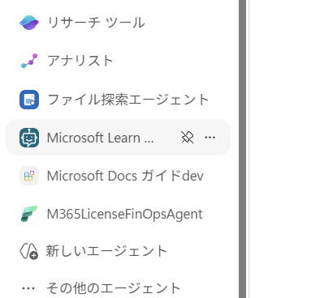

5. 左側の一覧から `Microsoft Learn ガイド` を開きます。

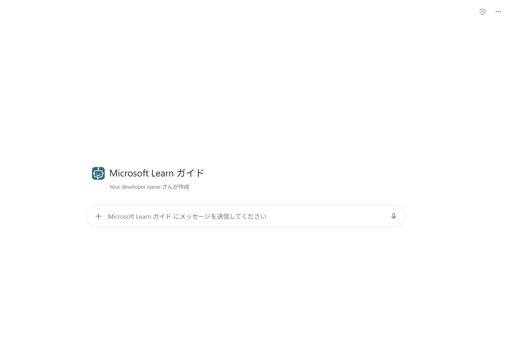

## 8. Microsoft 365 Copilot で動作確認する

1. Copilot Studio で使用したものと同じ質問を入力します。

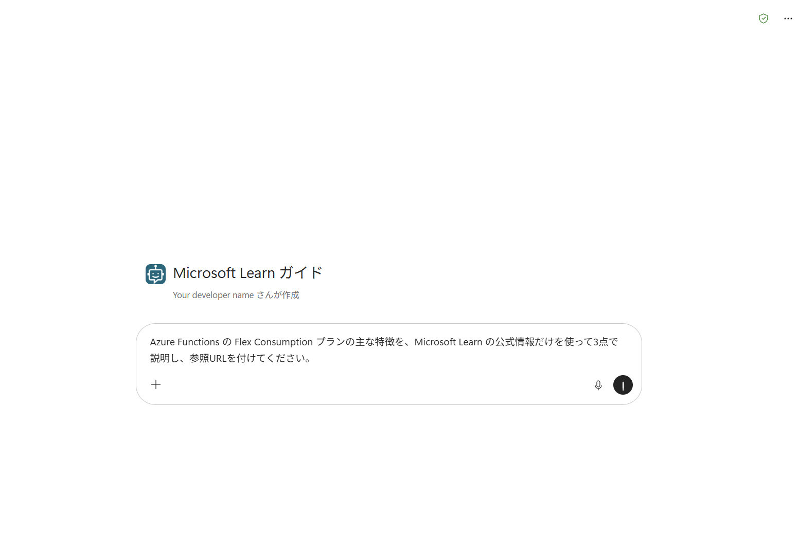

2. 初回だけ接続マネージャーが表示された場合は、`Microsoft Learn ドキュメント MCP` が**接続済み**であることを確認し、**送信**を選択します。

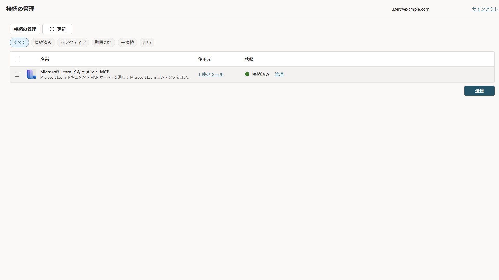

3. 質問を再送信し、回答が生成されることを確認します。

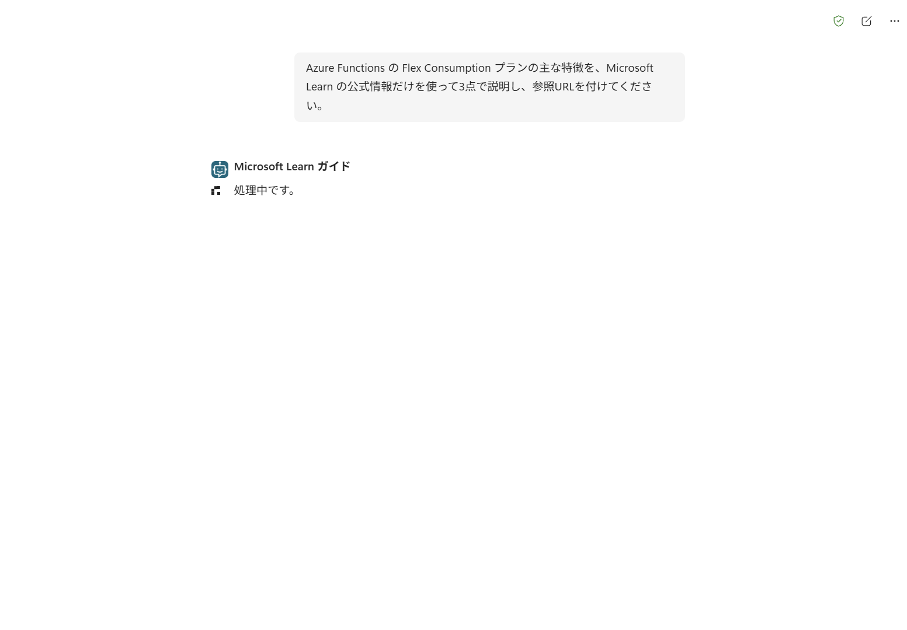

4. 回答本文、Microsoft Learn の根拠 URL、引用またはソースを確認します。


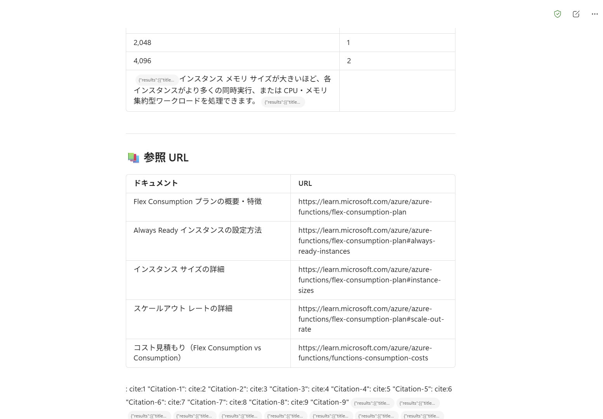

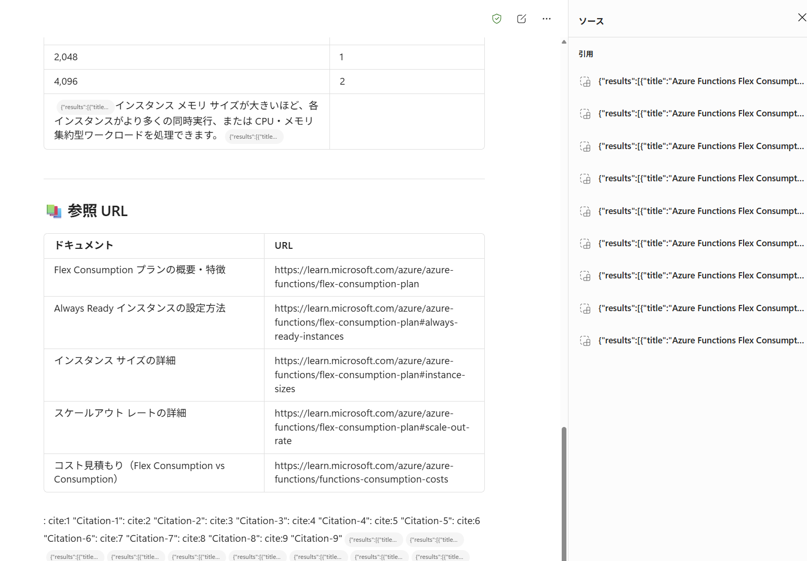

> [!NOTE]
> Microsoft 365 Copilot の UI によっては、ソース名に MCP の JSON 断片が表示される場合があります。回答内の `https://learn.microsoft.com/` URLを開き、公式ページへ移動できることを主な確認基準にしてください。

ここまで確認できれば、Microsoft 365 Copilot から Microsoft Learn MCP を呼び出すエージェントは完成です。

## トラブルシューティング

### エージェントを作成できない

- Copilot Studio 右上の環境が正しいか確認します。
- Power Platform 管理者に、環境の Dataverse と `Environment Maker` ロールを確認してもらいます。
- `prvReadbot`、`prvReadbotcomponent`、`prvReadSolution` などの権限エラーが出る場合は、Dataverse のセキュリティ ロールが不足しています。管理者にエラー全文を共有してください。

### Microsoft Learn MCP を追加できない

- 検索語を `Microsoft Learn` にします。
- カスタム MCP ではなく、認定済みの **Microsoft Learn ドキュメント MCP サーバー**を選びます。
- DLP ポリシーでコネクタがブロックされていないか管理者に確認します。

### テストで接続要求が繰り返される

- 接続マネージャーを開き、状態が**接続済み**か確認します。
- **送信**を選択してからテスト画面へ戻ります。
- 接続を更新した後は、同じ質問を再送信します。

### MCP が呼び出されない

- 指示に「必ず Microsoft Learn Docs MCP Server を使う」と明記します。
- テスト時は Web 検索を無効にし、活動マップで `microsoft_docs_search` の実行を確認します。
- エージェントを変更した後に再公開したか確認します。

### Microsoft 365 Copilot に表示されない

- エージェントが公開済みか確認します。
- Microsoft 365 と Microsoft Teams チャネルが追加済みか確認します。
- 利用者または利用者が所属するセキュリティ グループへ共有されているか確認します。
- **[同僚による構築] に表示する**がオンか確認します。
- Microsoft 365 Copilot を再読み込みし、エージェント一覧から追加してピン留めします。
- 組織全体へ公開する場合は、管理者による承認状況を確認します。

## 公式情報

- [Microsoft Learn MCP Server の概要](https://learn.microsoft.com/training/support/mcp)
- [Microsoft Learn MCP Server の開発者向けリファレンス](https://learn.microsoft.com/training/support/mcp-developer-reference)
- [Teams と Microsoft 365 にエージェントを接続して構成する](https://learn.microsoft.com/microsoft-copilot-studio/publication-add-bot-to-microsoft-teams)
- [Microsoft 365 Copilot 向けエージェントを公開する](https://learn.microsoft.com/microsoft-365/copilot/extensibility/publish)
- [Copilot Studio のライセンスと課金](https://learn.microsoft.com/microsoft-copilot-studio/billing-licensing)
- [Copilot Credits の料金表](https://learn.microsoft.com/microsoft-copilot-studio/requirements-messages-management#copilot-credits-billing-rates)
- [Microsoft 365 Copilot 拡張機能のコスト](https://learn.microsoft.com/microsoft-365/copilot/extensibility/cost-considerations#licensing-options-for-microsoft-365-copilot)
- [Microsoft 365 のエージェント管理ガイド](https://learn.microsoft.com/microsoft-365/copilot/agent-essentials/m365-agents-admin-guide)
